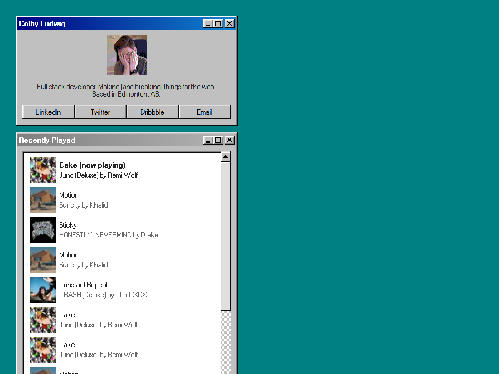

# ldwg

A personal "profile" site for myself to replace my existing one. Built with [98.css](https://jdan.github.io/98.css) and [Next](https://nextjs.org/).

## Setting up

- Register a Last.fm application [here](https://www.last.fm/api/account/create). Duplicate `.env` as `.env.local`, and override it with your API key.
- Replace `LASTFM_USERNAME` with your Last.fm username in `pages/api/last-fm.js` (line 3).

## Available Scripts

The usual scripts for Next.js -- `next dev`, `next build`, etc.
